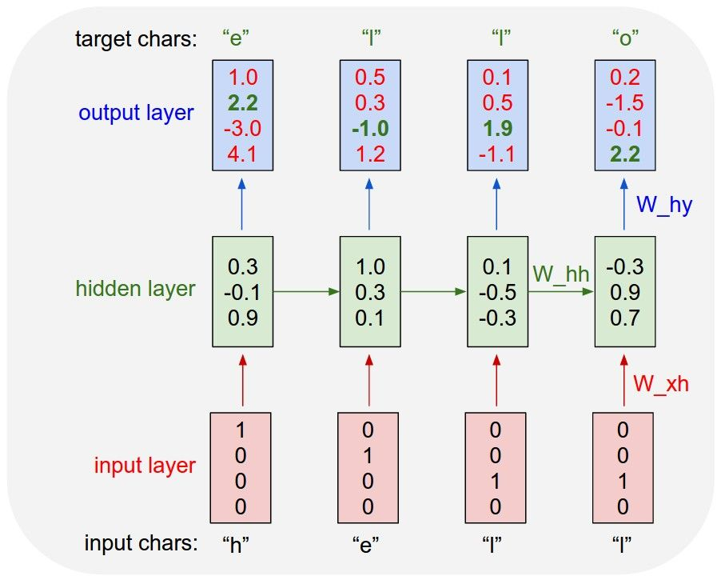

#  عنوان : شبکه عصبی

یادگیری عمیق ابزاری فوق العاده برای ساخت پروژه های مهیج و سرگرم‌کننده است، هر روز خبری در مورد کاربرد های جدید یادگیری عمیق منتشر میشود و همگان را در تعجب فرو میبرد، آموزش این مدل های جذاب هم در نوع خودش سرگرم‌کننده است مخصوصا مدل های مرتبط به پردازش زبان طبیعی(NLP).

آماده سازی

برای شروع به تنسورفلو و نامپای نیاز خواهیم داشت که میتوانید با دستور زیر آنها را نصب کنید :

   >  pip install -U tensorflow-gpu
    
   >  pip install -U numpy

ما از دیوان حافظ استفاده میکنیم اما میتوانید برای دقت بیشتر از اشعار سعدی یا فردوسی استفاده کنید(یا هرنوع متن بالای 100 هزار کارکتر)، اشعار حافظ را با دستور زیر دریافت میکنیم :

> 1- wget -O hafez.txt https://raw.githubusercontent.com/amnghd/Persian_poems_corpus/master/normalized/hafez_norm.txt

ابزار های مورد نیاز را ایمپورت میکنیم و سپس محتوای کتاب را میخوانیم :

>  1- import tensorflow as tf

>  2- import keras

>  3- from keras.layers import  Input, LSTM, Dense

>  4- import tensorflow.keras.optimizers as optimizers

>  5- import numpy as np

> 6- import random

> 7-

> 8-  text = open(&quothafez.txt&quot, &quotr&quot, encoding=&quotutf-8&quot).read()

پردازش متن و ایجاد دیتاست

شبکه عصبی نمیتواند داده ها به صورت متنی دریافت کند، برای همین باید کارکتر ها را به اعداد صحیح تبدیل کنیم :

> 1- chars = sorted(list(set(text)))

> 2- char_indices = dict((c, i) for i, c in enumerate(chars))

> 3- indices_char = dict((i, c) for i, c in enumerate(chars))

رای تولید متن مدل با دیدن کارکتر های قبل یاد میگیرد که کارکتر بعدی کدام است :

پس با توجه به تصویر بالا، input ها یک ایندکس از آخر عقب تر از target ها هستند و target ها نیز یک ایندکس از اول جلوتر از input ها هستند، پس به این شیوه متغییر های x و y رو میسازیم:

> 1- maxlen = 40

> 2- step = 3

> 3- sentences = []

> 4- next_chars = []

> 5- for i in range(0, len(text) - maxlen, step):
   
   > 6- sentences.append(text[i : i + maxlen])
   
   > 7-  next_chars.append(text[i + maxlen])

> 8- x = np.zeros((len(sentences), maxlen, len(chars)), dtype=np.bool)

> 9- y = np.zeros((len(sentences), len(chars)), dtype=np.bool)

> 10- for i, sentence in enumerate(sentences):
  
  > 11- for t, char in enumerate(sentence):
      
  > 12- x[i, t, char_indices[char]] = 1
     
  > 13- y[i, char_indices[next_chars[i]]] = 1

مدل سازی

حالا میتوانیم مدل LSTM خود را تعریف کنیم. در اینجا از یک لایه LSTM با 128 واحد حافظه به عنوان حافظه پنهان و لایه خروجی یک Dense layer هست که از تابع softmax استفاده میکند، برای بهینه ساز هم از Adam استفاده میکنیم :

model = keras.Sequential(
   
   [
       
   keras.Input(shape=(maxlen, len(chars))),
       
   layers.LSTM(128),
       
   layers.Dense(len(chars), activation=&quotsoftmax&quot),
   
   ]

)

optimizer = optimizers.Adam(learning_rate=0.01)

model.compile(loss=&quotcategorical_crossentropy&quot, optimizer=optimizer)

به دلیل اینکه مدل برای پیش‌بینی کارکتر بعدی، احتمال هر کارکتر را برمیگرداند، یک تابع برای text sampling نیاز خواهیم داشت:

def sample(preds, temperature=1.0):
    
    # helper function to sample an index from a probability array
    
    preds = np.asarray(preds).astype(&quotfloat64&quot)
    
    preds = np.log(preds) / temperature
    
    exp_preds = np.exp(preds)
    
    preds = exp_preds / np.sum(exp_preds)
    
    probas = np.random.multinomial(1, preds, 1)
    
    return np.argmax(probas)

و در آخر آموزش مدل را آموزش میدهیم :

> 1- epochs = 40

> 2- batch_size = 128

> 3-

> 4- model.fit(x, y, batch_size=batch_size, epochs=40)

آموزش مدل روی NVIDIA Tesla K50 حدود دو دقیقه طول کشید. حالا میتوانیم مدل را تست کنیم :

      1- for i in range(10):
   
      2- start_index = random.randint(0, len(text) - maxlen - 1)
   
      3- for diversity in [0.2, 0.5, 1.0, 1.2]:
   
       4- print(&quot...Diversity:&quot, diversity)

       5-        
      
              6- generated = &quot&quot
       
              7- sentence = text[start_index : start_index + maxlen]
       
              8- print('...Generating with seed: &quot' + sentence + '&quot')

              9-      
      
              10- for i in range(400):
           
              11- x_pred = np.zeros((1, maxlen, len(chars)))
           
              12- for t, char in enumerate(sentence):
              
              13- x_pred[0, t, char_indices[char]] = 1.0
              
              14- preds = model.predict(x_pred, verbose=0)[0]
           
              15- next_index = sample(preds, diversity)
              
              16-  next_char = indices_char[next_index]
              
              17- sentence = sentence[1:] + next_char
              
              18- generated += next_char
              
              19-
      
      20- print(&quot...Generated: &quot, generated)
       
       21- print()

با اجرای کد، ده متن با diversity های مختلف تولید میشود :

